# Element Face SDK iOS
Version 1.9.6

## Overview
* Simple interface with encapsulated Element account creation and authentication functionalities
* Works with Objective-C and Swift
* Uses the user’s face as an authentication modality
* Support local processing (on device) and remote processing (on server)

---

## Download
You need to download the ElementSDK.framework and the associated files (assets in ThemeBundles.zip and local processing add-on in LocalProcessing.bundle.zip) on your Element dashboard page under **Account -> SDK -> SDK Files:**

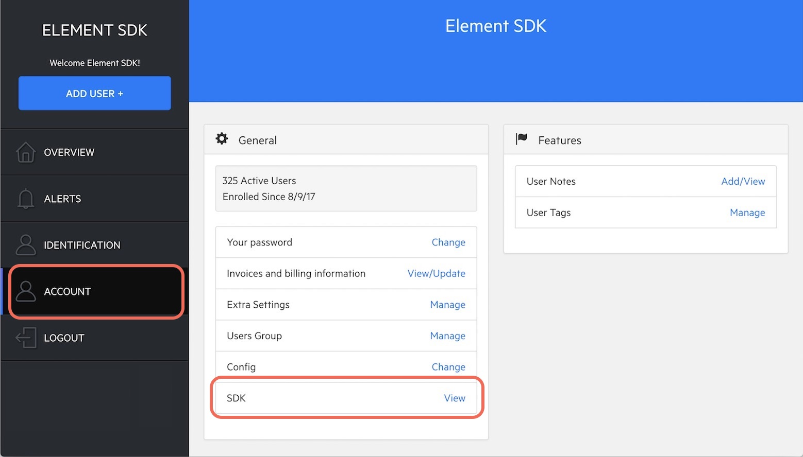

On this page you will also find relevant documentation (a PDF file):

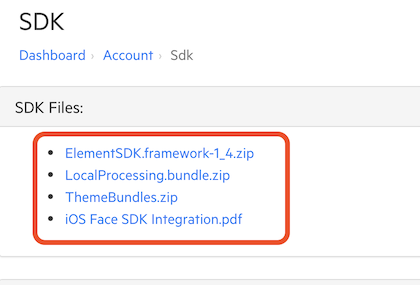

Chrome or other browsers may give you a warning about downloading the zipped framework, you may discard the warning and download the framework:

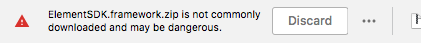

The framework and bundles are zipped, you can double click on these files to unzip them.

### Notes

 The Framework was not built with Bitcode enabled so you may have to disable Bitcode for your app in order to link against the Element SDK. To do that, click on your project in Xcode then go to the "Build Settings" tab and search for Enable Bitcode and set it to *No*.
 
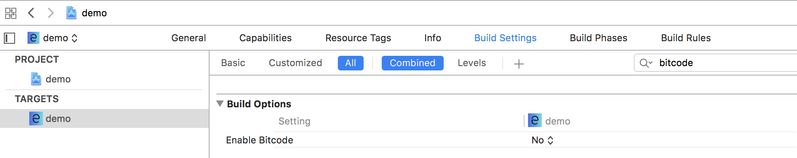
 
 The Element Face iOS SDK supports iOS 10 and above.
 
---

## Adding The Framework to Your Xcode Project

To use the Element SDK, you need to add it to your Xcode project, like any third party framework.

1. Copy the Element SDK (ElementSDK.framework) in your project.
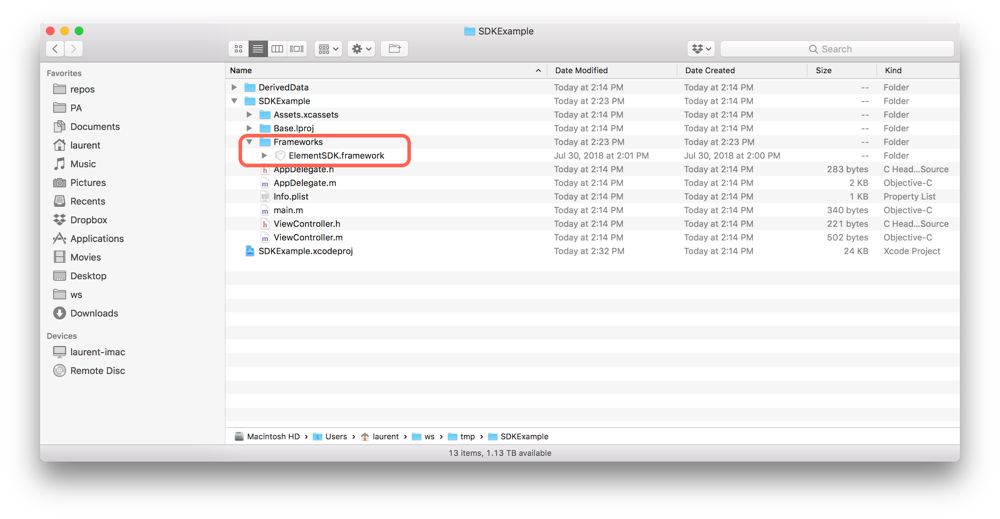
1. Embed / link against the Element SDK: in Xcode, click on your project, select your app target, go to the “General” tab then scroll down to the “Embedded Binaries” section and click on the “+”.
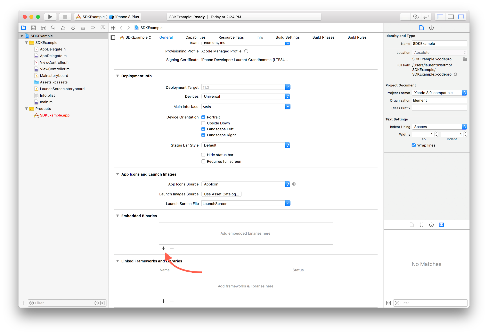
1. Select the Element SDK by clicking on “Add Other...” then selecting the framework on disk.
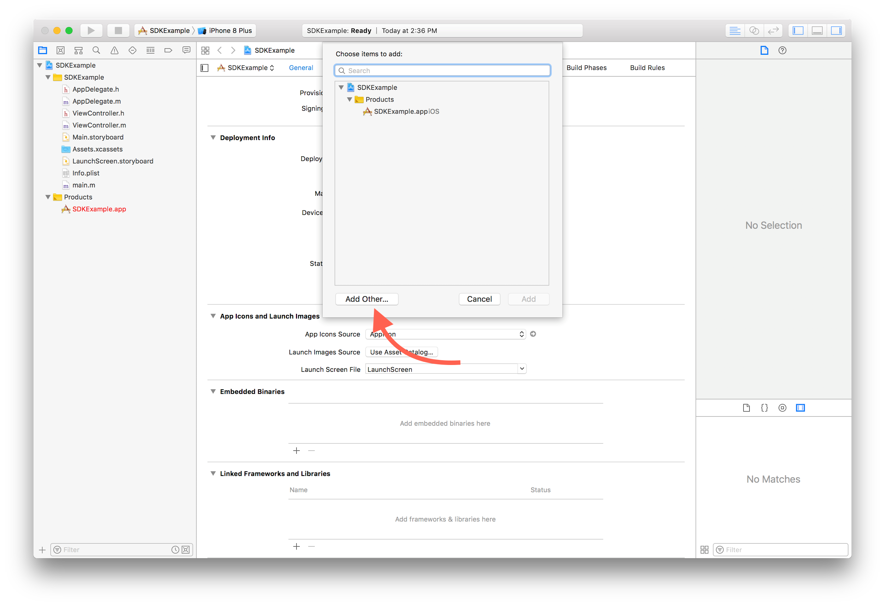

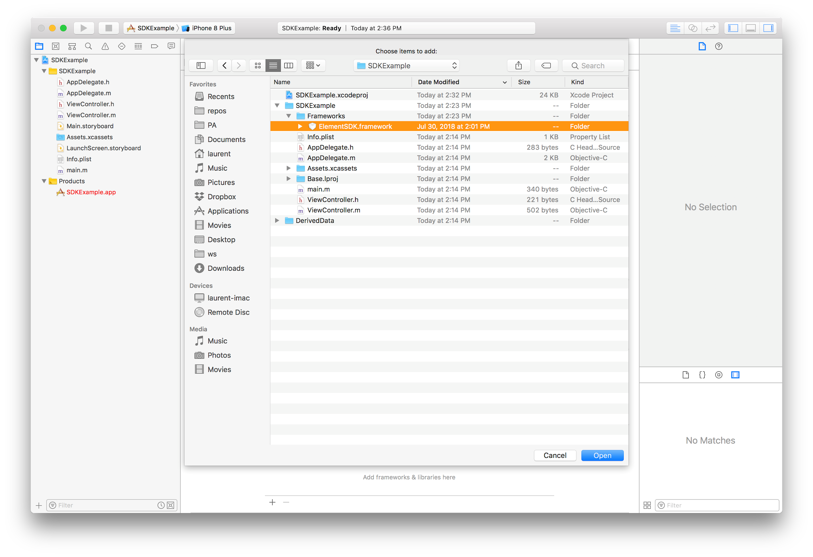
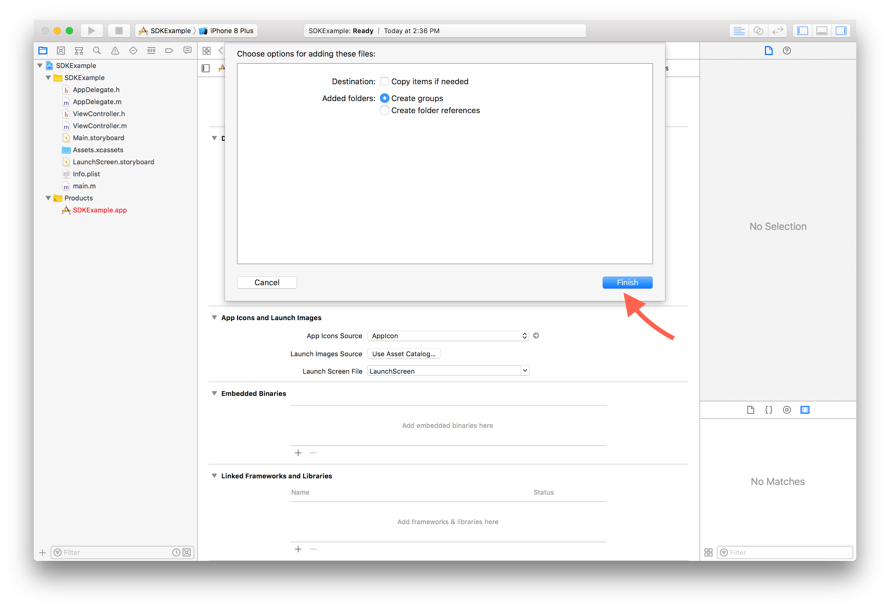
1. Add the required assets bundle(s) to your project

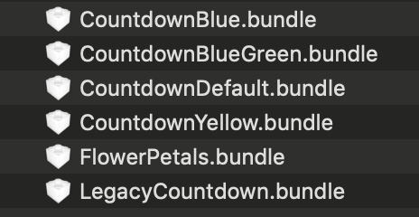
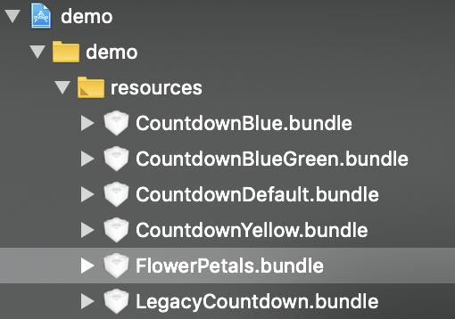

Bundles are named after the ELTUITheme enum:
```swift
/**
 *  Enums for user interface theme
 */
typedef NS_ENUM(NSInteger, ELTUITheme) {
    /**
     *  Default: blue and white
     */
    ELTUIThemeCountdownDefault = 0,
    /**
     *  New theme with flower animation
     */
    ELTUIThemeFlowerPetals,
    /**
     *  yellow theme
     */
    ELTUIThemeCountdownYellow,
    /**
     *  blue theme
     */
    ELTUIThemeCountdownBlue,
    /**
     *  blue green theme
     */
    ELTUIThemeCountdownBlueGreen,
    /**
     * less animation, blue theme
     */
    ELTUIThemeLegacyCountdown
};
```

You’re now ready to use the Element SDK. Do not forget to disable “Bitcode” if it’s enabled for your target (see "Notes" above)

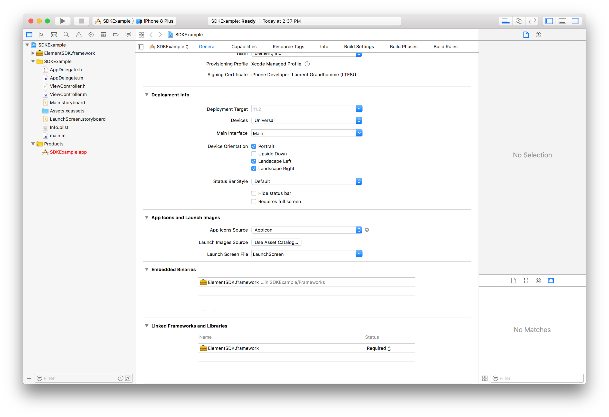
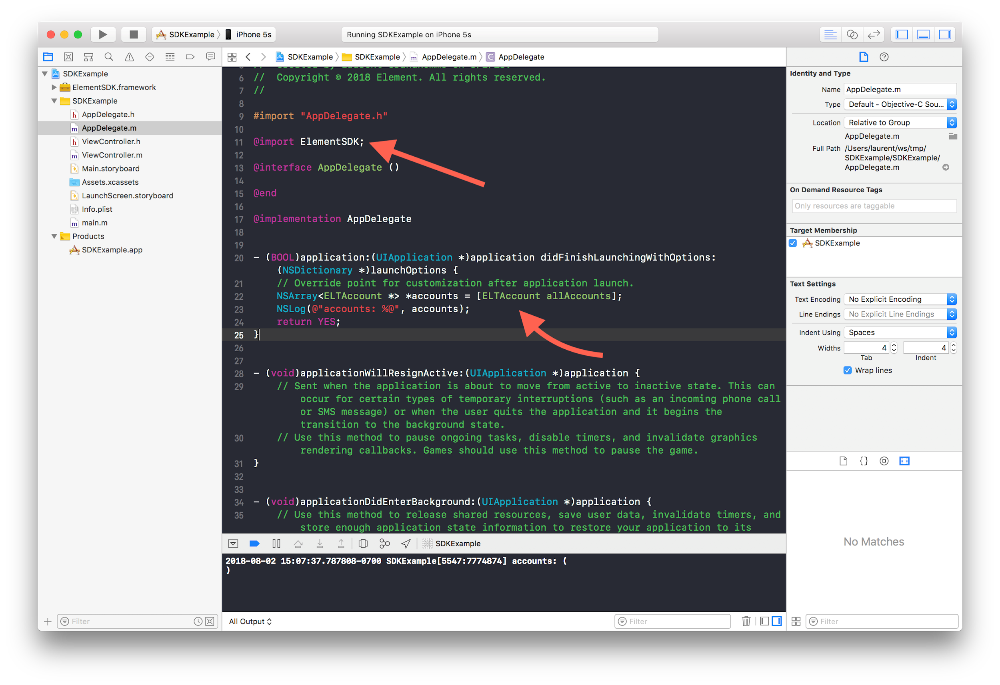

## Info.plist / OS level authorizations

### Camera access

The SDK uses the phone’s camera to authentication users, it is required to add the “NSCameraUsageDescription” field in your application plist:

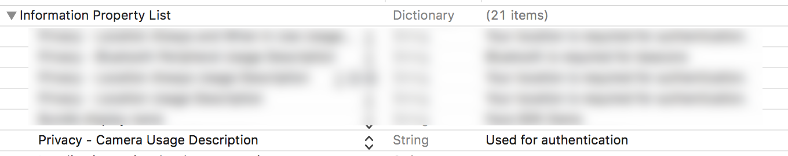

### Location access (optional)

If you need access to the user’s location at the time of authentication (see Common settings (Swift) and Common settings (Objective-C)), you need to add the required field to the plist (text that will be shown to the user before the SDK asks for location access) “NSLocationWhenInUseUsageDescription”:

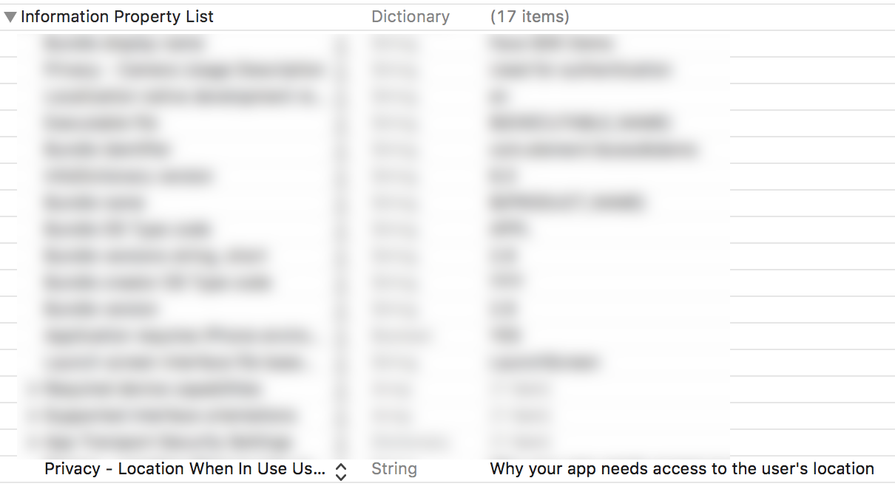

## iOS Simulator

The ElementSDK requires camera access to function so it isn’t built for the simulator.
It is possible to exclude the ElementSDK code when running in the simulator:

### Objective-C example

```smalltalk
#if !(TARGET_IPHONE_SIMULATOR)
        // load the ElementSDK
        NSLog(@"device");
#endif
```

### Swift example

```swift
#if !(targetEnvironment(simulator))
import ElementSDK
// do stuff
#endif
```

## Disabling linking for XCode 11.4 and above
*To exclude the ElementSDK.framework when running in the simulator (for Xcode 11.4 and above).*

When selecting the **project > target > "Build Settings"** tab, look for "Excluded Source File Names".  For all your configurations, click on the "+" and select "any ios simulator", in the value field, enter "ElementSDK.framework" to exclude our SDK when running in the simulator.

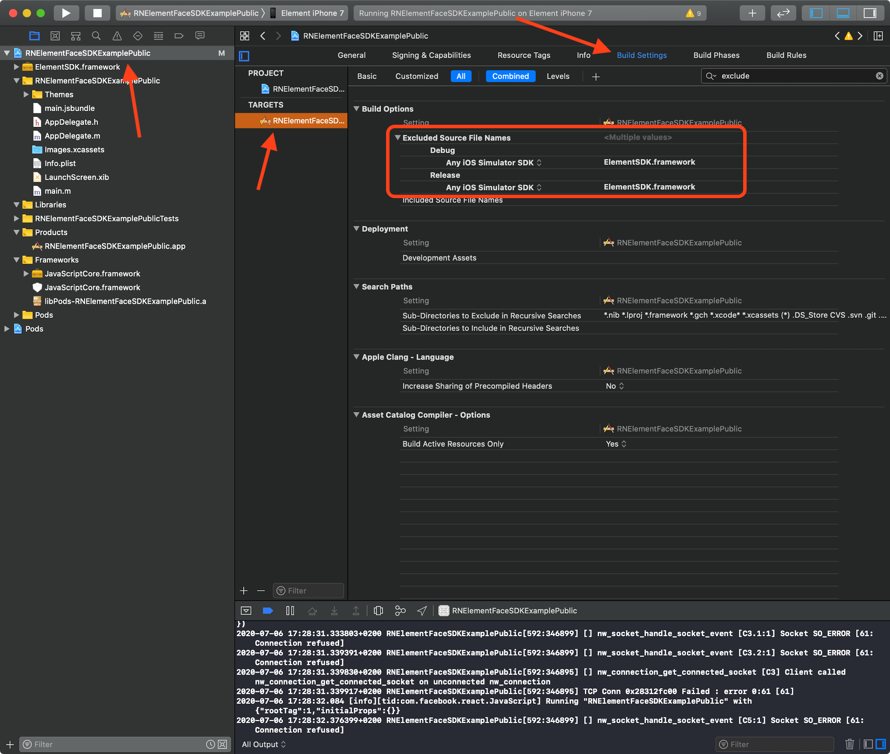
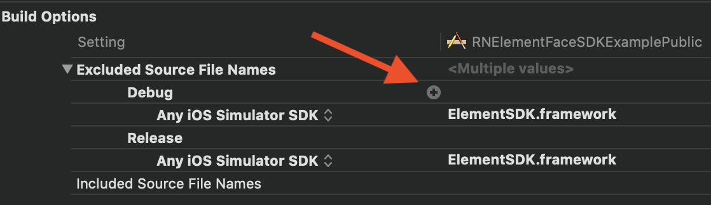
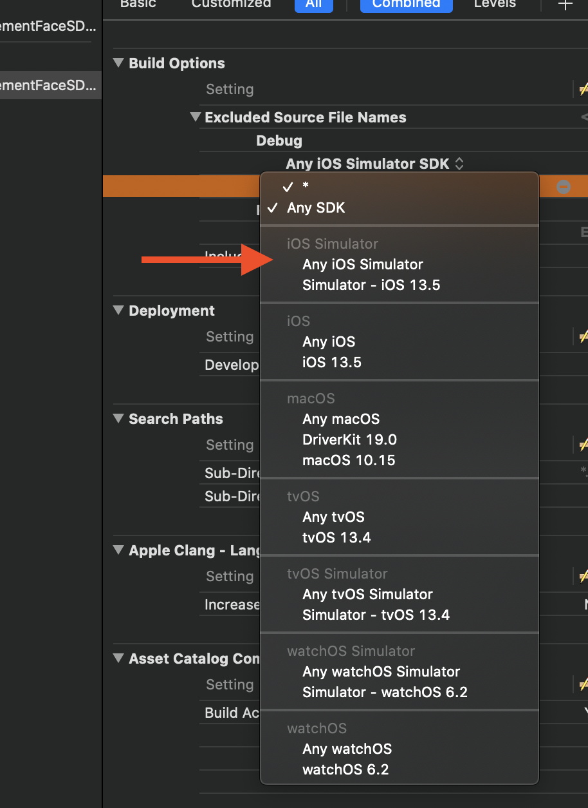

---

## Configuration

The Element SDK needs to be configured with your EAK (Encrypted Access Key) before use, it is recommended to do that in your application delegate code (UIApplicationDelegate), when the application is launched:
* Swift: `func application(_ application: UIApplication, didFinishLaunchingWithOptions launchOptions: [UIApplicationLaunchOptionsKey: Any]?) -> Bool`
* Objective-C: `- (BOOL)application:(UIApplication *)application didFinishLaunchingWithOptions:(NSDictionary *)launchOptions`

See **EAK - Encrypted Access Key** below for more information.

The ElementSDK provides liveness detection, it is enabled by default but you can configure this by selecting the appropriate `faceAntiSpoofingType` value.  See **Liveness detection** below for more information.

Another key thing you can set is the `theme`; the newest theme is the `ELTUIThemeFlowerPetals` and it is recommended.  You will need to add the associated bundle to your Xcode project (example: the `ELTUIThemeFlowerPetals` uses the files in the `FlowerPetals.bundle` bundle).  See **Theme** below for more information.

Other values you can set are:
* Whether or not you need the user’s location at the time of authentication:
Attribute `geolocateUserDuringAuthentication` of the ElementSDKConfiguration singleton
* Whether or not you need the user’s location at the time of enrollment:
Attribute `geolocateUserDuringEnrollment` of the ElementSDKConfiguration singleton
* Whether or not you want the user’s photos to be uploaded on your data cloud server for quality insurance / safekeeping:
Attribute `uploadImages` of the ElementSDKConfiguration singleton
* `timeoutInterval` can be set to specify the limit on the idle interval allotted to a network request in the process of loading.  This is especially important for the “Remote” mode of the SDK.  The default is 30 seconds but you can set it to a longer interval if you expect poor connectivity (3 minutes or 180 seconds for instance)
* `uploadImageQuality` can be set to configure the quality (resolution) of the images uploaded to the backend / cloud
* `skipOSAuthorizationHeadsUpScreens` can be set to TRUE to disable screens that explain with an image and some text why the app / SDK is about to ask the user’s permission to access the camera or location

### EAK - Encrypted Access Key

The account creation email you received contains a link where you can register your appId (which is the Bundle Identifier on iOS: CFBundleIdentifier); doing so will create a configuration encrypted access key (referred to as “EAK”), the EAK is the only data required to configure the SDK.  

You can also visit your Element dashboard to get your already created EAK or register your appId/Bundle Identifier by following the following steps:
* Fill the App Id field with your application Bundle Identifier, and click on Create EAK.
* Copy the string in the EAK column to your clipboard and you can also download the EAK file for safekeeping.

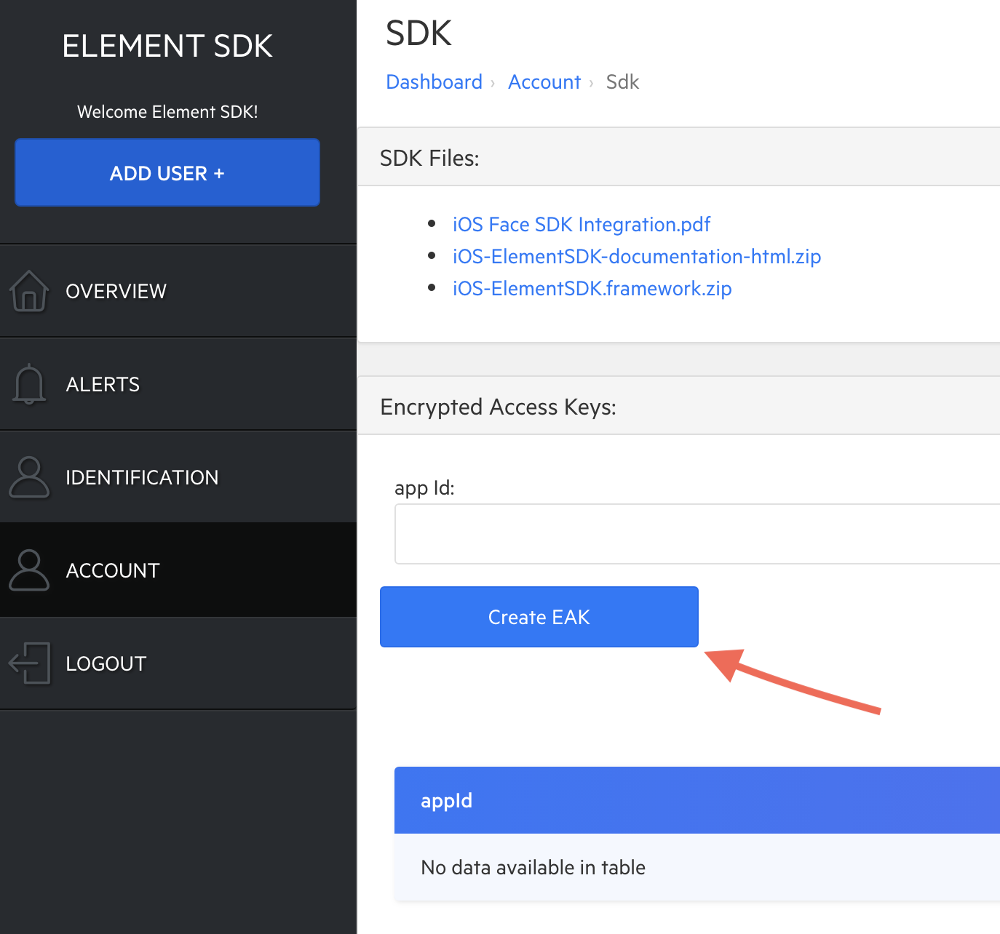

Note that for security reasons this configuration data is encrypted.
Once created, you can now copy the EAK and use it in your code or download it.

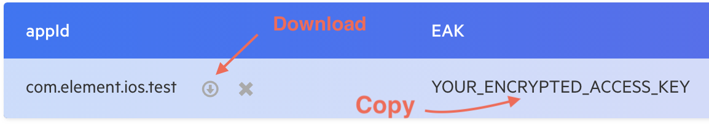

```swift
/*!
 Initialize the SDK with the configuration data
 @param eakString EAK - SDK Configuration Data provided by Element
 
 @return A boolean that indicates whether the initialization succeeded (it can fail if the app's
 Bundle Identifier (CFBundleIdentifier) doesn't match the appId contained in configurationData)
 */
- (BOOL)initializeWithConfigurationData:(nonnull NSString *)eakString;
```

### Local Sample Application
You can download a demo application on Github:  <https://github.com/Element1/element-ios-face-sdk-local-example>
It shows how to integrate and use the Framework (all the APIs described in this document are used in the demo). The project is located in the Example directory, it is called *face_demo_protected.xcodeproj*

Please note that this public repository doesn’t contain the ElementSDK.framework (the framework contained in the ElementSDK.framework.zip zip file) so you will need to copy it in the following directory: *element-ios-face-sdk-local-example/Example/demo/Frameworks*

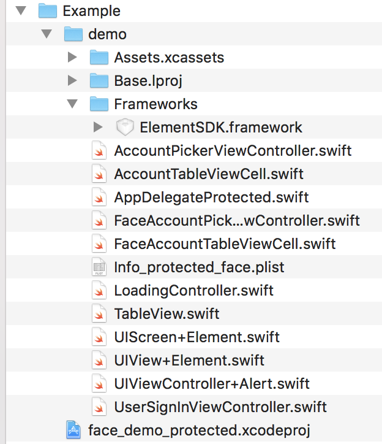

The demo application can only be run on a device (it doesn’t run in the simulator).  
### Putting it all together
To add Element’s face biometry to your app:
1. Match your own user ids with Element’s userId by either using the same id, using a 1 way function to get your element id from your own user id or by having another sort of mapping.
1. Check if your user has an Element account on the device by using the getAccountByUserId method.
1. If the ELTAccount’s faceAccountState is ELTAccountStateReady, you can start authenticating your users.
1. If the ELTAccount’s faceAccountState is ELTAccountStateUserInitNeeded, you need to perform user enrollment.
1. If you don’t have an ELTAccount on your device for your user, you can check if it’s available on the cloud by using ElementSDKTransaction’s userSignInWithUserId method.

If the account is available, you’re all set. Otherwise, create your account by using `ELTAccount`’s **`createNewAccountWithUserId` method** and **perform user enrollment**.


### Remote Sample Application
You can download a demo application on Github: <https://github.com/Element1/element-ios-face-sdk-remote-example>
It shows how to integrate and use the Framework (all the APIs described in this document are used in the demo). The project is located in the Example directory, it is called *fm-demo-public.xcodeproj*

Please note that this public repository doesn’t contain the *ElementSDK.framework* (the framework contained in the ElementSDK archive) so you will need to copy it in the following directory: *element-ios-face-sdk-remote-example/Example/demo/Frameworks*

The demo application can only be run on a device (it doesn’t run in the simulator).  You will need to enter your api key and your base url in order to run the app.
